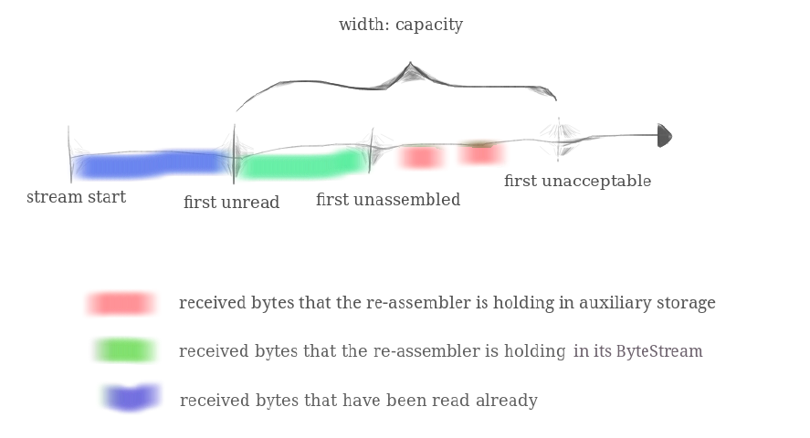
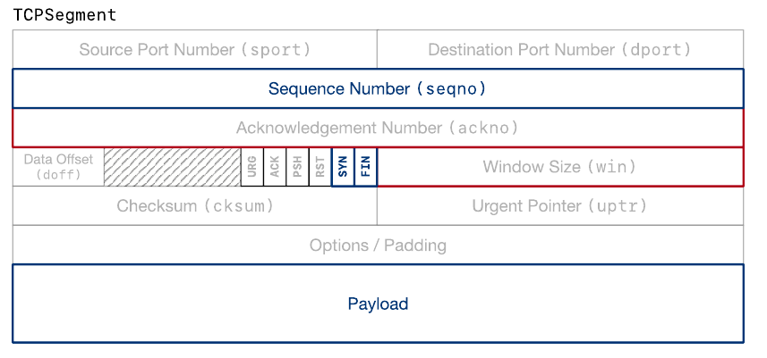
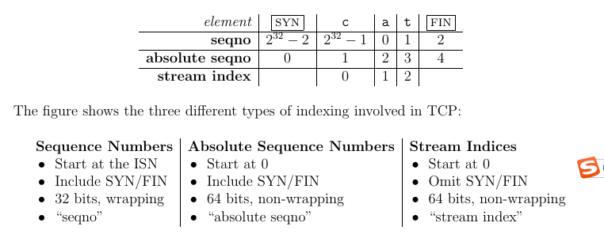

#  CS144
计算机网络课程笔记
## lab0 
* 实现了一个bytestream类，用于在有限的存储空间中存储无限的数据流。当写数据时，数据从后边扩展，读数据时，数据从前边pop。具体的实现见byte_stream.cc和byte_stream.hh。

## lab1
* 实现了一个stream_reassembler类，将乱序到达或者有重叠的字符串重新组装成连续的stream。核心是lab1文档中3.1节的那个图,如下。

 * 用storage来储存乱序到达的数据，然后当storage有连续数据时立马加入到lab0中实现的bytestream中。把不按序到达的数据尽可能存放起来，一旦出现连续数据就进行交付，所谓交付就是指把连续数据从storage write到output（是一个bytestream）。然后storage就空出空间来能够继续接收不按序和按序到达的数据
 * 上图中绿色的已经被交付给了bytestream
* 本实验的核心代码是stream_reassembler.cc和stream_reassembler.hh，主要实现push_substring函数
* 实现过程的挑战：一开始没有彻底理解这个数据结构的作用，用的是优先队列的方法，比较繁琐；后来看了测试数据后，大概理解了stream_reassember的作用，就开始实现现在所看到的数据结构；对于边界条件和EOF比较麻烦，对于EOF的处理，加了一个新的private变量EOFindex标记EOF的位置就使得程序变得简单
## lab2
* 实验文档随笔
 	* 需要实现接收TCP报文段，重装数据流，将以TCP协议发送的数据经过unwrap转化到stream中。为了确认和流量控制需要从receiver返回给sender的数据。
 	* 应用程序从ByteStream中读取数据，这个数据是连续的。也就是从TCPsocket中读。
	 * 逻辑开始SYN和逻辑终止FIN占据单独的序列号（sequence number）。SYN的第一个序列号是ISN，第一个真实数据是ISN+1而不是ISN+0.
	 * 需要注意区分序列号（sequence number）、绝对序列号（absolute sequence number）、数据流索引（stream index）这三个概念的区别。之所以有这个区别是因为stream index、absolute sequence是64位的，而TCP头部的空间是有限的，能用32位就绝不用64位。
	 * 在0-2^32范围内随机ISN能够增强安全性，防止旧的连接的TCP段干扰新连接的TCP段。之所以能够防止干扰，是因为每个TCP的payload为了适合单个链路层帧，最多不能超过1500字节（引自计算机网络自顶向下，和[链接](https://stackoverflow.com/questions/2613734/maximum-packet-size-for-a-tcp-connection#:~:text=10%20Answers&text=The%20absolute%20limitation%20on%20TCP,for%20instance%2C%20is%201500%20bytes.),这个链接也指出了如果更大的payload会造成数据截断、数据出错等问题），而这个1500字节相比于2^32是一个很窄很窄的范围。我每次都随机一个ISN，旧的TCP对新的TCP造成干扰的概率是1500/2^32=0.000000375,更不用说还需要事先判断源端口号是否相同，这会进一步降低碰撞概率。
 	* TCP每次接收的stream index域的序号范围（也是unwrap的输出uint64_t范围）在[checkpoint-2^32/2,checkpoint+2^32/2]范围内（checkpoint反映了当前receiver接收到的stream index域的序号），如果sender很早以前的TCP没有被路由器丢弃，且TCP连接在很长时间过后还没有断开，那么经过很长时间后，很早以前的TCP被receiver收到了，此时碰撞的概率还是1500/2^32。但这是假设没有被丢弃以及TCP没有断开连接，实际中很可能早就断开或者丢弃了。而且根据TCP协议，当前receiver想要的在window范围中的数据会更小，碰撞导致出错的概率就更低了。
	 * 本实验重点关注如下

 	* 下边的是序号之间的转换关系

	* window size是first_unassembled和first_unacceptable之间的距离
	* 每次将32位的seqno解压（unwrap）成64位的uint时，需要设定一个基准：(uint64_t)checkpoint。这个checkpoint是last reassembled byte。
	* 一个TCP段中可能SYN和FIN都置1
	* 如果FIN标志置位的话，说明payload的最后一位是eof，即是字节流中的最后一位
	* 2^64个字节用11TB/s的速度传送的话需要50年，而2^32个字节用相同的速度传送只需要0.33秒。
* 实验过程
	* 首先是将uint64_t的绝对序列号转化成uint32_t的序列号，转换方法lab2文档中有。接着是将uint32_t的序列号根据checkpoint的基准转化成uint64_t的绝对序列号。unwrap和wrap
	* TCPsegment类中实现了header和payload数据的解析，也通过计算机网络自顶向下中对UDP数据可靠性检验的校验和描述的原理进行了检验。也可见[链接](https://en.wikipedia.org/wiki/IPv4_header_checksum)中对检验和(checksum)的描述。
	* 在看别人写的代码的过程中，要倾向于用广度而不是深度，初次看时重点在代码框架，每个函数或者类了解其输入输出即可。一定不要陷入某个函数的具体实现细节中出不来，在初次看时唯一需要深入细节的时候就是当函数的输入输出不明白，需要通过实现细节来了解输入输出。等熟悉了整个代码后，就可以对一些细节进行深入研究。
	*  ackno代码用到了optional，文档[见此](https://www.boost.org/doc/libs/1_76_0/libs/optional/doc/html/index.html),主要用于解决某一个变量比如int类型，所有可能取值都是有效的，但是有时候这些变量还没有契机为其赋值，如果不用optional的方法的话，可以新建一个标志位，标志其有没有效，但是用optional就可以不用标志位就能标记其有效与否。就比如说在本实验的ISN的实现中，加了一个_recievedSYN的标记位；而用optional的话，不加标记位也可以，而且可读性还更好。
	*  ackno需要注意，FIN的ack序号和非FIN的ack序号是不一样的（这里的ack序号是基于streamindex说的）。FIN的ack序号是firstUNassemble+1，而非FIN的ack序号是firstUNassemble.因为FIN单独占据序号空间的一个值。
	*  SYN TCP段，在计算机网络自顶向下中提到是不携带payload的，但是在实现TCPReceiver::segment_received的过程中，只有假设SYN段也可能携带数据才能通过所有测试集。具体的原因见[链接](https://blog.csdn.net/dog250/article/details/108540823#:~:text=%E4%BC%97%E6%89%80%E5%91%A8%E7%9F%A5%EF%BC%8CTCP%E7%9A%84SYN%E6%8A%A5,%E6%95%B0%E6%8D%AE%E7%9A%84%E5%BA%8F%E5%88%97%E5%8F%B7%E5%8C%BA%E9%97%B4%E3%80%82).
	*  FIN和SYN可能同时置位，FIN置位代表当前payload的最后一位是eof，需要使得Bytestream endinput。
	*  本实验的核心就是充分理解seqno、absoluteseqno、streamindex的相互转化关系，然后调用前两个实验的函数实现。wrap和unwrap借助ISN将uint64_t压缩到uint_32_t或者将uint32_t解压缩到uint64_t,这两个转换是可逆且无失真的.
## lab3
* 实验[文档](./file/lab3.pdf)随笔
	* 需要跟踪所有没有被确认的TCPsegment，如果超出一定时间没有回复，则进行重传（超时重传）
	* SYN和FIN也占据window的空间
	* 不用考虑receiver接收的数据被截断、然后返回的ackno是截断的序号。返回的ackno肯定能确认所有之前发送的某一TCPsegment的payload。见FAQ
	* 每隔few milliseconds调用一次tick，指示上一次调用到现在经过了多少ms
	* 实验文档中所述的定时器管理机制和计算机网络自顶向下描述的是差不多的，包括_clock的启动、重设、超时等等。有一个指数增长的超时重传机制
* 实验过程
	* 本实验主要实现的是一个TCPsender，主体功能是在已知receiver端windowsize的情况下尽可能把sender端Bytestream中的数据read后发送给receiver端，同时需要注意SYN和FIN也占据windowsize的空间。主要的复杂度在如何处理各种边界情况。
	* 主要的代码写在[tcp_sender.hh](./code/tcp_sender.hh)和[tcp_sender.cc](./code/tcp_sender.cc)两个文件中。主要实现的函数包括tick、ack_received、fill_window和FirstPushTO_segments_out、RetransPushTO_segments_out。具体函数的功能实现及注释见源代码。
	* 使用时，主要是先ack_received，更新receiver端的窗口大小并确认暂存队列的TCPsegments，然后调用fill_window尽可能的发送sender端的Bytestream的数据，并把发送的数据暂存队列中，在此期间由tick主要进行定时器管理，并在超时时重发最久远没有被确认的seg（重发机制涉及到receiver窗口非0时指数重传和receiver窗口为0时的等时重传）。需要注意的是，在发送sender端的Bytestream时，要把整个流理解为在核心数据的首部之前加SYN，核心数据的末尾（eof）后加FIN的抽象数据流，把抽象数据流转换成一块块的TCPsegment发送给receiver。
## lab4
* 实验文档随笔
	* 不鼓励阅读测试集代码，除非已经走投无路。阅读测试集写出来的代码可能鲁棒性不好。
	* tick函数被操作系统周期性的调用。
	* 最难的部分在于什么时候彻底终止TCPConnection并宣布不再active了。
	* 本实验主要就是把_sender和_receiver的东西用起来,并解决两个合在一起造成的问题
	* 全双工通道见下图
		* 
	* 所有ackno有效的TCPsegment都置ack为1
	* 当receiver想要告诉对端一个比uint16还大的windowsize时，需要有限幅
	* 有两种方法使得connection end
		* 一种是unclean shutdown，发送或接收到了RST，此时输出输入流应该set error，active应return false
		* 另一种是clean shutdown， 结束without an error，且确保两方的数据都完整的被对方接收到