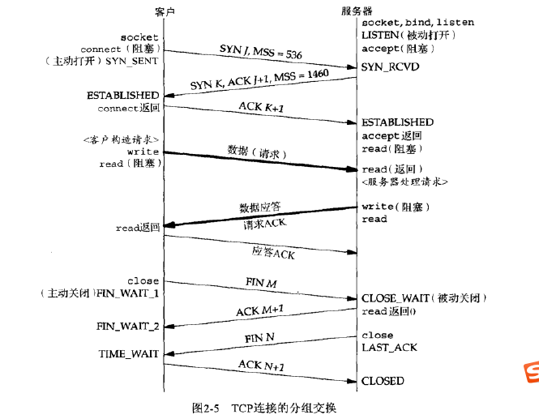

# UNP
## 第五章 TCP客户/服务器程序示例
* 探讨许多边界条件：客户和服务器启动时发生什么？客户正常终止时发生什么？服务器进程在客户之前终止？等等
* 单独接收到FIN将导致read函数返回0
* connect发起三次握手
* listen创建一监听套接字
* accept一直阻塞到监听套接字established队列有fd才返回
* 
* 被动收到FIN才有CLOSE_WAIT状态
* 子进程终止时，会给父进程发送一个SIGCHLD信号
* 信号处理函数可以中断慢速系统调用，并通过设置看是重启还是使系统调用退出。退出后会设置errno=EINTR错误
* 当一个进程向某个已收到RST的套接字执行写操作时，内核向该进程发送一个SIGPIPE信号。写一个已接收FIN的套接字不成问题，但是写一个已接收RST的套接字则是一个错误.
* Unix系统关机时，init进程通常先给所有进程发送SIGTERM信号，等待一段时间（让SIGTERM的信号处理函数进行清除和终止工作），然后给所有仍在运行的进程发送SIGKILL信号
* 总结来看，套接字的引用计数为0时，发送FIN给对端，对端若阻塞在read，则退出阻塞，返回0；对端若在接收到FIN的socket进行write（这是允许的，且能够给对方发送过去），那么会收到对方发来的RST，再写RST就会brokenpipe，brokenpipe后会由write设置errno为EPIPE；收到RST若正处于read阻塞，则调用返回ECONNRESET错误。
* 服务器与客户端如果大端小端不一致，那么在传递数值数据时会时常，除非事先告知对方的大小端，以便能在解析数据时提前知道。