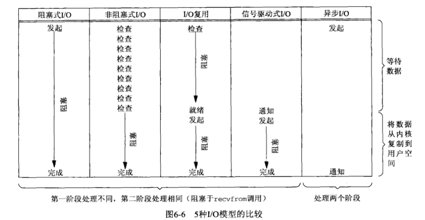

# UNP
## 第三章 套接字编程简介
* 字节流套接字上的read和write函数所表现的行为不同于通常的文件I/O。字节流套接字上调用read或write输入或输出的字节数可能比请求的数量少，然而这不是出错的状态。这个现象的原因在于内核中用于套接字的缓冲区可能已到达了极限。write到内核缓冲区的数据不一定全部都发到对端了，实际上就是CS144中所讲的write到Bytestream，然后按照TCP协议去发。read的话就是read Bytestream，Bytestream是TCP协议交付数据存放的地点，可以把Bytestream 当成内核缓冲区。

## 第四章 基本TCP套接字编程
* close一个TCP套接字后，该套接字描述符不能再由调用进程使用，也就是说它不能再作为read或write的第一个参数。

## 第五章 TCP客户/服务器程序示例
* 探讨许多边界条件：客户和服务器启动时发生什么？客户正常终止时发生什么？服务器进程在客户之前终止？等等
* 单独接收到FIN将导致read函数返回0
* connect发起三次握手
* listen创建一监听套接字
* accept一直阻塞到监听套接字established队列有fd才返回
* 
* 被动收到FIN才有CLOSE_WAIT状态
* 子进程终止时，会给父进程发送一个SIGCHLD信号
* 信号处理函数可以中断慢速系统调用，并通过设置看是重启还是使系统调用退出。退出后会设置errno=EINTR错误
* 当一个进程向某个已收到RST的套接字执行写操作时，内核向该进程发送一个SIGPIPE信号。写一个已接收FIN的套接字不成问题，但是写一个已接收RST的套接字则是一个错误.
* Unix系统关机时，init进程通常先给所有进程发送SIGTERM信号，等待一段时间（让SIGTERM的信号处理函数进行清除和终止工作），然后给所有仍在运行的进程发送SIGKILL信号
* 总结来看，套接字的引用计数为0时，发送FIN给对端，对端TCP连接读半关闭，对端若阻塞在read，则退出阻塞，返回0；对端若在接收到FIN的socket进行write（这是允许的，且能够给对方发送过去），那么会收到对方发来的RST（若对方已经退出进程），再写RST就会brokenpipe，brokenpipe后会由write设置errno为EPIPE；收到RST若正处于read阻塞，则调用返回errno=ECONNRESET错误；如果正在进行系统调用，然后被信号处理函数中断而没有重启系统调用，则会设置errno=EINTR；
* 服务器与客户端如果大端小端不一致，那么在传递数值数据时会失常，除非事先告知对方的大小端，以便能在解析数据时提前知道。

## 第六章 I/O复用：select和poll函数
* 同步I/O操作：导致请求进程阻塞，直到I/O操作完成
* 异步I/O操作：不导致请求进程阻塞
* 
* select被中断也会返回errno为EINTR
* 可以用select和poll实现微秒级的定时器
* select可同时监控fd的可读、可写、有异常待处理，且能够在超时微秒级后返回。
* 
* 接收低水位标记和发送低水位标记能够界定可读可写。
* ping程序是测量RRT的一个简单方法
* close终止读和写两个方向的数据传送。也就是说调用close后该套接字既不能read，也不能write。这就导致了在回显程序中，客户端读入一个EOF后close socket，给客户端发送了FIN，之后客户端就不能读取任何从服务端发送来的数据了，就造成了回显数据的不完整，可用shutdown来对这个问题进行解决。
* 拒绝服务攻击：针对服务器做些动作，导致服务器被挂起，进而不能再为其他合法客户提供服务
* poll提供的功能与select类似，不过在处理流设备时，能够提供额外的信息，这样的话能够根据反馈得到的信息灵活处理。且poll相比较与select在应用时不需要复杂的用户管理新定义的数组结构
* 

## 第七章 套接字选项
* getsockopt用来得到当前的套接字选项，setsockopt用来设置当前的套接字选项。
* 并非所有实现都支持所有的套接字选项
* 套接字选项可以设置诸如接收缓冲区大小、发送缓冲区大小、接受缓冲区低水位标记、发送缓冲区低水位标记、接受超时、发送超时、禁止Nagle算法等选项。
	* 
	* 
* SO_KEEPALIVE套接字选项能够隔一段时间自动在应用层无法感知的情况下给对端发送一个保持存活探测分节
* SO_LINGER套接字选项
	* 本选项指定close函数对面向连接的协议如何操作
	* 
	* 默认操作是close立即返回，但是如果有数据残留在套接字发送缓冲区中，系统将试着把这些数据发送给对端.SO_LINGR套接字使得我们可以改变这个默认设置。setsockopt传递一特定的结构，如果l_onoff为0，则保持close的默认设置,
		* 如图
	* setsockopt，如果l_onoff为非0值且l_linger为0，那么当close某个连接时TCP将终止该链接。也就是说TCP将丢弃保留在套接字发送缓冲区中的任何数据，并发送一个RST给对端，而没有通常的四分组连接终止序列（四次挥手）。
	* setsockopt，如果l_onoff非零且l_linger也非0，那么当套接字close时内核将拖延一段时间，这就是说如果在套接字发送缓冲区中仍残留有数据，那么进程将阻塞在close中，直到所有数据都已发送完毕且均被对方确认或延滞时间到（见下两图）。如果在数据发送完并被确认前延滞时间到的话，close将返回EWOULDBLOCK错误，且套接字发送缓冲区中的任何残留数据都被丢弃。
		* 
		* 
		* 由此可见，l_linger字段设置的是延滞时间，若在该时间内没有收到FIN的ack，那么close将直接返回并发送RST
	* 